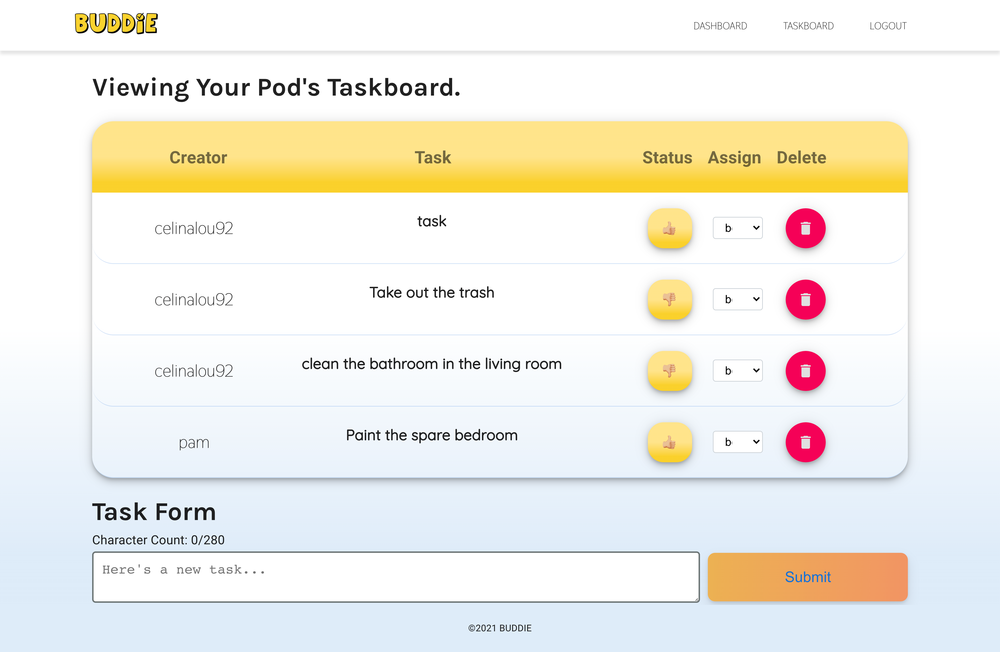

# Buddie Social Media Application

## Description

This application is a social media platform that allows users to manage shared household chores/tasks and interact via a messageboard.



## Table of Contents

- [Installation](#installation)
* [Deployed App](#deployed-app)
* [Questions](#questions)


## Installation
1. Create Atlas DB and get CLUSTER_USER_KEY, CLUSTER_NAME, and DB_USERNAME
   - Save these to preffered env variable set up
2. Install dependencies in both the server and client directories.
   
    ```npm install ```

## Run Buddie 
1. Client 
   1. Start front end locally
      
       ```npm run start ```
2. Server
   1. Run Node server and connect to database 
    - You will need the Atlas CLUSTER_USER_KEY, CLUSTER_NAME, and DB_USERNAME
  
    ```npm run start ```

# Running MongoDB locally
https://www.mongodb.com/docs/manual/tutorial/install-mongodb-on-os-x/
https://www.mongodb.com/docs/mongodb-shell/reference/configure-shell-settings/#std-label-mongosh-shell-settings
https://reflectoring.io/tutorial-graphql-apollo-server-nodejs-mongodb/

## Deployed App
https://buddie2-0.vercel.app/


## Questions
For any questions please reach out to via:
github: [celinalou92](https://github.com/celinalou92) or
email: celinalouissaint@gmail.com

